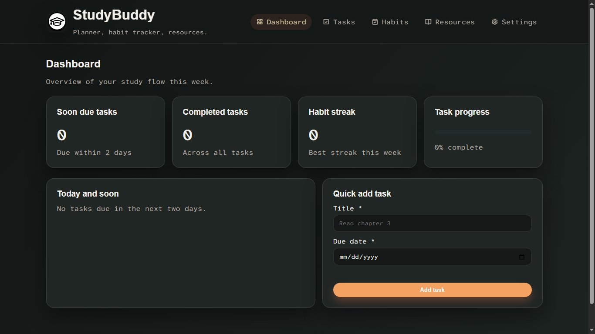
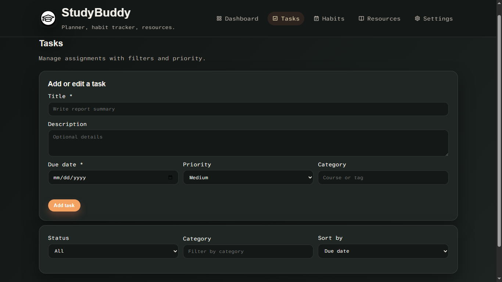
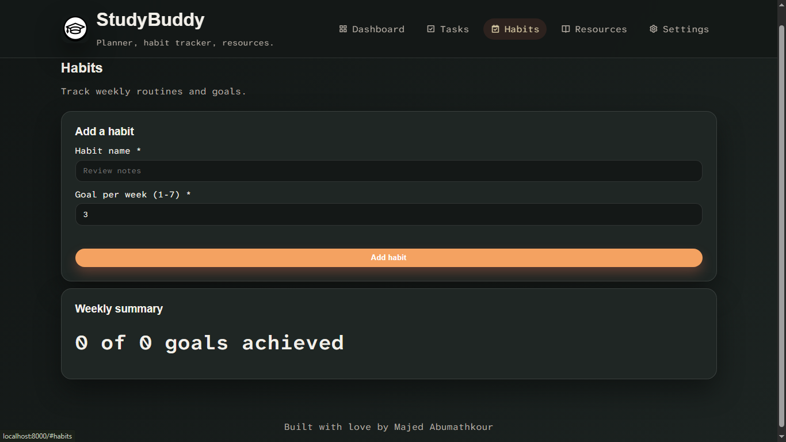
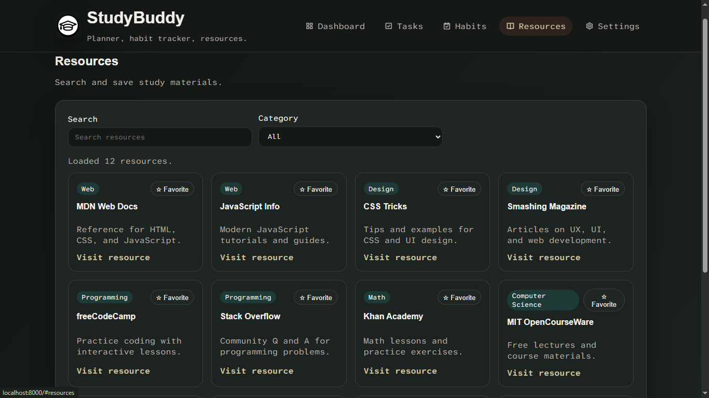
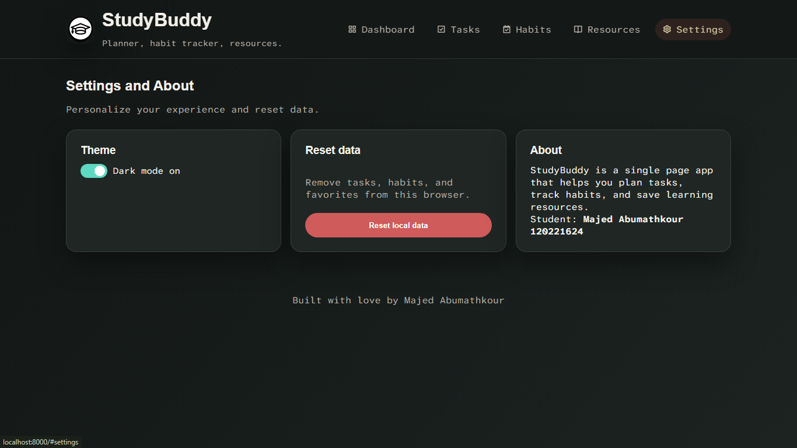

# StudyBuddy (SPA)

## Project Description
StudyBuddy is a responsive single-page web application built with HTML, CSS, and vanilla JavaScript. It helps students manage tasks, track weekly study habits, and organize learning resources through a clean dashboard interface.

## Features
- Single Page Application (SPA) navigation (Dashboard, Tasks, Habits, Resources, Settings)
- Tasks CRUD (Create, Read, Update, Delete) with validation and confirmation
- Filters and sorting for tasks (status, category, priority, due date)
- Weekly habit tracker with goal progress and weekly summary
- Resource library loaded via async `fetch()` with search, category filter, and favorites
- Theme toggle (Light/Dark) stored in localStorage
- Reset data button with confirmation
- Mobile-first responsive layout using CSS Grid and Flexbox
- Data persisted in localStorage (tasks, habits, favorites, settings)

## How to Run (Detailed)
This project uses `fetch()` to load `resources.json`, so it must be served from a local web server.

### Option 1: Python (recommended)
1. Open a terminal in the project root (same folder as `index.html`).
2. Run:
   - `python -m http.server 8000`
3. Open your browser at:
   - `http://localhost:8000`
4. Keep the terminal running while testing.

### Option 2: VS Code Live Server
1. Install the **Live Server** extension if you don’t have it.
2. Right‑click `index.html` → **Open with Live Server**.

### Common Problems
- If you open `index.html` directly (file://), `fetch()` will fail.
- Make sure the server is running and you’re using `http://localhost:8000`.

## Code Structure
- `index.html`: SPA structure (header, sections, forms, containers).
- `style.css`: theme variables, components, layout, responsiveness.
- `state.js`: app data model and default state.
- `storage.js`: localStorage save/load + async fetch for resources.
- `ui.js`: DOM rendering, events, validation, and app bootstrapping.
- `resources.json`: static data source for Resources section.

## Screenshots
### Dashboard

### Tasks

### Habits

### Resources

### Settings

